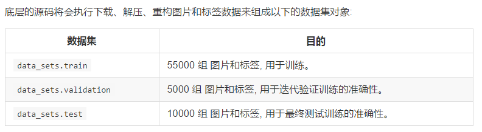

# Tensorflow函数变化
  * tf.sub() --> tf.subtract()
  * tf.mul() --> tf.multiply()
  * tf.types.float32 --> 为tf.float32
  * tf.pact() --> tf.stact()

# MNIST
  * input\_data.py  
       下载用于训练和测试的MNIST数据集的源码  
  * maybe\_download()  
       将训练数据下载到本地文件夹中  
       文件夹名字由fully\_connected_feed.py文件顶部一个标记变量指定
  * extract\_images()、extract\_labels()函数  
       手动解压图片数据  
       形成2维的tensor[image index, pixel index]  
       "image index"/  数据集中图片编号  
       "pixel index"/    图片中像素点个数(0~图片像素上限)
  * 数据集对象  
        
  
   
        
 <table>
                                 <tr><th width="500">*数据集</th><th width="500">*目的</th></tr>
 <tr><td>data_sets.train</td><td>55000 组 图片和标签, 用于训练。</td></tr>
                             </table>
 
